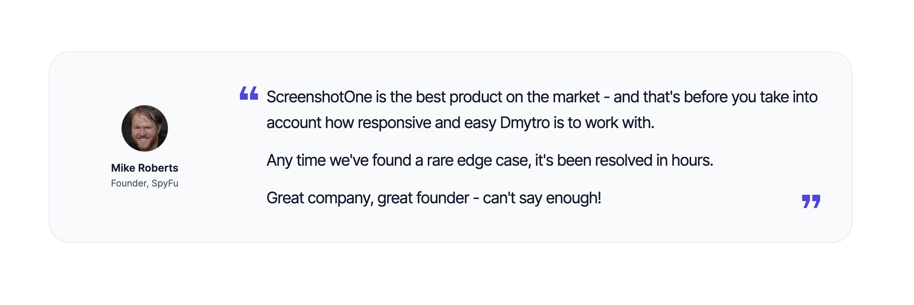

# ScreenshotOne for Cursor

Capture website screenshots, extract clean Markdown, and check your ScreenshotOne usage from Cursor. This official plugin connects to the [ScreenshotOne hosted MCP server](https://screenshotone.com/docs/mcp/) through browser-based OAuth sign-in.

You need a [ScreenshotOne account](https://dash.screenshotone.com) with available quota. Screenshot and Markdown renders use your organization's quota and plan limits; see [pricing](https://screenshotone.com/pricing/).

## About the ScreenshotOne API

[ScreenshotOne](https://screenshotone.com/) helps developers and AI agents automate website screenshots without maintaining browsers or rendering infrastructure. The full API lets you:

- Capture websites, HTML, or Markdown as images, including full-page screenshots and custom viewport sizes.
- Block cookie banners, ads, and chat widgets, and customize rendering with CSS and JavaScript.
- Generate [PDFs](https://screenshotone.com/pdf-generation-api/) and [scrolling screenshot videos or GIFs](https://screenshotone.com/scrolling-screenshots/).
- Extract page content as HTML or Markdown, alongside screenshots and page metadata.

Explore the [API documentation](https://screenshotone.com/docs/), [screenshot options](https://screenshotone.com/docs/options/), [SDKs and code examples](https://screenshotone.com/integrations/code/), and [use cases](https://screenshotone.com/use-cases/). This plugin exposes the three tools listed below; additional API features are available through the API and SDKs.

## Customers

ScreenshotOne is used by **more than 1,000 customers** and [**thousands of developers**](https://screenshotone.com/), including teams at Kinsta, SpyFu, and Typeshare. [Meet our customers and read their testimonials](https://screenshotone.com/customers/).

[](https://screenshotone.com/blog/rivalflowai-by-spyfu/)

[Read how RivalFlow AI by SpyFu uses ScreenshotOne](https://screenshotone.com/blog/rivalflowai-by-spyfu/).

## Install and connect

To [install the plugin locally](https://cursor.com/docs/plugins#test-plugins-locally):

1. Copy this repository's contents to `~/.cursor/plugins/local/screenshotone/`.
2. Restart Cursor or run **Developer: Reload Window**.
3. Open **Customize** and find the ScreenshotOne MCP server.
4. Choose **Authenticate**, sign in to ScreenshotOne in your browser, and approve the connection.
5. Return to Cursor and ask it to check your ScreenshotOne usage.

The manifest must be at `~/.cursor/plugins/local/screenshotone/.cursor-plugin/plugin.json`. Check any existing installation before replacing it. Enterprise teams may need an admin to allow local plugins.

To connect the hosted MCP server directly, merge this entry into your existing [Cursor MCP configuration](https://cursor.com/docs/mcp):

```json
{
  "mcpServers": {
    "screenshotone": {
      "url": "https://mcp.screenshotone.com"
    }
  }
}
```

Use the hostname root without a `/mcp` suffix and complete browser authentication. No local server, npm package, or manually configured API key is required. Choose one setup method to avoid duplicate connections.

## Tools

| Tool | What it does |
| --- | --- |
| `render-website-screenshot` | Returns a temporary JPEG URL; supports full-page captures, vertical slices, and an optional HTML or Markdown content URL |
| `extract-website-markdown` | Accepts a URL and returns cleaned page Markdown directly |
| `get-usage` | Returns the connected organization's quota and concurrency usage; takes no arguments |

The included [ScreenshotOne skill](skills/screenshotone/SKILL.md) describes the supported options and guides Cursor through using the results.

Try asking Cursor:

- “Check my ScreenshotOne quota.”
- “Take a screenshot of https://example.com and show me the result.”
- “Capture https://example.com as a full-page screenshot with vertical slices and Markdown content.”
- “Extract the Markdown from https://example.com and summarize the page.”

## Results and account access

Screenshot and slice URLs are temporary and must be opened to inspect the images. Screenshot URLs are available for [up to four hours](https://screenshotone.com/docs/screenshot-url/); content URLs include an expiration timestamp. Download results you need to keep, and share their links only with intended recipients.

ScreenshotOne renders publicly reachable HTTP and HTTPS URLs. It cannot access your laptop's `localhost` or reuse your browser's signed-in session.

Requests send the URL and supported options to ScreenshotOne. Sign-in and consent happen in ScreenshotOne Dashboard, and Cursor manages OAuth tokens. Manage or revoke connections under **Integrations → Connect MCP clients** in the [Dashboard](https://dash.screenshotone.com). Service data handling is covered by the [privacy policy](https://screenshotone.com/privacy-policy/) and [terms of service](https://screenshotone.com/terms-of-service/).

## Support and license

If authentication gets stuck, select **Reload** and then **Authenticate** in the ScreenshotOne MCP settings. For connection or rendering issues, contact [support@screenshotone.com](mailto:support@screenshotone.com) or [report a plugin issue](https://github.com/screenshotone/screenshotone-cursor-plugin/issues).

See the [hosted MCP documentation](https://screenshotone.com/docs/mcp/) for more details. Plugin source is licensed under [MIT](LICENSE); the logo's icon attribution is in [third-party notices](THIRD_PARTY_NOTICES.md).
